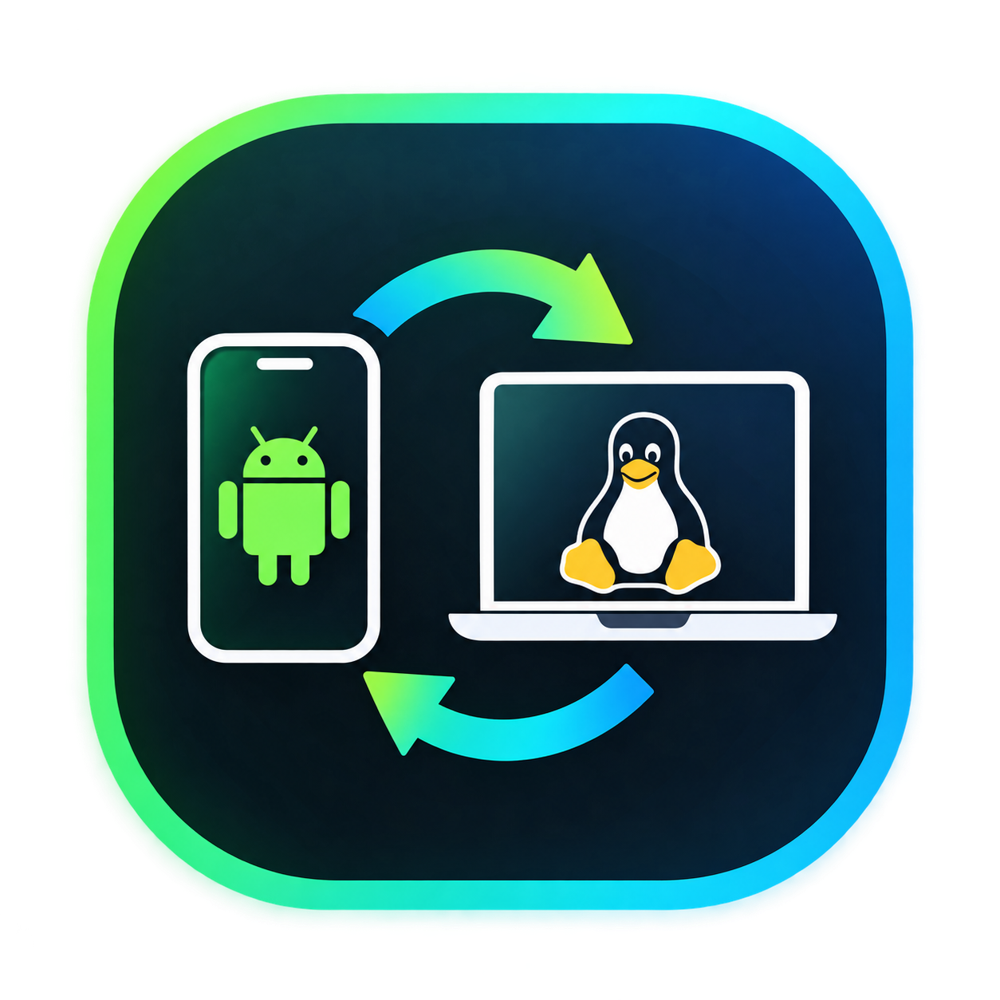

<p align="center">
  
</p>

# LinLink 🔗📱💻

> **Seamless, Fast, and Secure Companion Bridge between Android and Linux.**

LinLink connects your Android smartphone and Linux computer over your local network (LAN / Wi-Fi) with zero cloud dependency. Pair in seconds using a terminal QR code, synchronize your clipboard in real-time both ways, transfer files seamlessly, browse Linux files from your phone, and explore your phone's storage through an interactive Linux terminal shell.

---

## 📑 Table of Contents

- [Overview & Architecture](#-overview--architecture)
- [📱 Flutter Screens](#-flutter-screens)
- [🔄 How Flutter Connects to Linux](#-how-flutter-connects-to-linux)
- [✨ Key Features](#-key-features)
- [🐧 Rust Linux Companion Reference](#-rust-linux-companion-reference)
- [Prerequisites](#-prerequisites)
- [Quickstart Guide](#-quickstart-guide)
- [CLI Reference Manual](#-cli-reference-manual)
- [Interactive Shell Commands](#-interactive-shell-commands)
- [File Storage Locations](#-file-storage-locations)
- [Project Directory Structure](#-project-directory-structure)
- [Security & Privacy](#-security--privacy)

---

## 🏛 Overview & Architecture

LinLink consists of two synchronized components operating over high-performance local TCP:

```
┌────────────────────────────────────────────────────────┐
│                   Android Device                       │
│  • Flutter UI — Floating Glass Navigation Bar          │
│  • AndroidFileAgent (HTTP/TCP Server on Port 7879)     │
│  • Native File Manager Picker (SAF) + Storage Fallback │
│  • Continuous Live Clipboard Service                   │
│  • Instant disconnect via /fs/disconnect endpoint      │
└────────────────────────▲───────────────────────────────┘
                         │
                    Local Wi-Fi / TCP
                         │
┌────────────────────────▼───────────────────────────────┐
│                   Linux Machine                        │
│  • Linux Companion CLI (linlink)                       │
│  • Background Axum Daemon (Port 7878)                  │
│  • Wayland / X11 System Clipboard Engine               │
│  • Interactive Terminal Shell Client                   │
│  • systemd User Service (auto-start on login)          │
└────────────────────────────────────────────────────────┘
```

---

## 📱 Flutter Screens

### `HomeScreen` — [`lib/features/home/home_screen.dart`](lib/features/home/home_screen.dart)
Central dashboard with a **floating pill-shaped glass navigation bar** (`BackdropFilter` + `ImageFilter.blur(20,20)`, semi-transparent dark tint, drop shadow, animated active-tab highlight).

- **Unpaired**: App icon hero (`assets/icon.png`), QR scan button, manual IP entry, phone-to-phone P2P transfer card, and step-by-step Linux setup instructions.
- **Paired**: Device status card, clipboard sync toggle + preview, Share Files / Send Note quick actions, Privacy Mode toggle.
- **Instant disconnect**: When Linux sends `POST /fs/disconnect`, the app immediately clears paired state, stops sync, and shows a snackbar — no polling.

### `PairingSuccessScreen` — [`lib/features/pairing/pairing_success_screen.dart`](lib/features/pairing/pairing_success_screen.dart)
Post-pairing confirmation showing `assets/icon.png` badge (72×72, rounded), device details, and capability tiles.

### `ScannerScreen` — [`lib/features/scanner/views/scanner_screen.dart`](lib/features/scanner/views/scanner_screen.dart)
Camera QR scanner using `mobile_scanner` + BLoC. Parses `linlink://pair?host=...&port=...&token=...` and completes handshake in under a second.

### `RemoteFileBrowserScreen` — [`lib/features/storage/remote_file_browser_screen.dart`](lib/features/storage/remote_file_browser_screen.dart)
Browse Linux filesystem from Android, download files with one tap, upload via native SAF picker.

---

## 🔄 How Flutter Connects to Linux

```
Android (Flutter)                              Linux Host (linlink)
       │                                                │
       │  1. Scan QR → parse linlink://pair?...         │
       │───────────────────────────────────────────────>│
       │                                                │
       │  2. POST /pair/scan + POST /pair/handshake     │
       │───────────────────────────────────────────────>│ Port 7878
       │                                                │
       │  3. 200 OK (token, session_id)                 │
       │<───────────────────────────────────────────────│ Spawns background daemon
       │                                                │
       │  4. Start AndroidFileAgent on Port 7879        │
       │     POST /api/device/register {agent_port}     │
       │───────────────────────────────────────────────>│ Daemon records phone IP
       │                                                │
       │  5. Live Clipboard Auto-Sync (800ms poll)      │
       │<──────────────────────────────────────────────>│
       │                                                │
       │  6. File operations & linlink shell            │
       │<──────────────────────────────────────────────>│
       │                                                │
       │  7. linlink stop → POST /fs/disconnect         │
       │<───────────────────────────────────────────────│ Android clears state instantly
```

---

## ✨ Key Features

### 1. Real-Time Bidirectional Clipboard Sync
- Copy on Linux → instantly on Android. Copy on Android → instantly on Linux.
- Wayland (`wl-copy`/`wl-paste`) and X11 (`xclip`/`xsel`) native support.
- Intelligent deduplication prevents echo loops.

### 2. Mobile → Linux File Upload
- Native Android SAF (`FilePicker`) or built-in storage browser fallback.
- Streams files directly over TCP to any Linux directory.
- Quick Text Notes: push `.txt` notes to Linux in one tap.

### 3. Linux → Mobile Remote File Browser
- Browse your Linux filesystem from the Android app.
- One-tap download to `/storage/emulated/0/Download/LinLink/`.

### 4. Interactive Linux Shell (`linlink shell`)
Terminal REPL connected directly to your Android storage:
`ls`, `cd`, `pwd`, `cat`, `get`, `put`, `mkdir`, `rm`, `clip`.

### 5. Zero-Config QR Code Pairing
- ANSI QR code with auto-detected LAN IP.
- Under-a-second handshake. Manual IP fallback available.

### 6. Background Daemon & systemd Integration
- Graceful `SIGINT`/`SIGTERM` handling.
- `systemd` user service for auto-start on login.
- Full session persistence in `~/.config/linlink/`.

### 7. Instant Linux Disconnect Notification *(new)*
- `linlink stop` sends `POST /fs/disconnect` to Android **before** the process exits.
- Android immediately clears paired state, stops sync, returns to the connect screen, and shows a snackbar — within 2 seconds, no polling.

### 8. App Icon Branding *(new)*
- `assets/icon.png` displayed in the AppBar, onboarding hero, and pairing success screen.

### 9. Floating Glass Navigation Bar *(new)*
- Pill-shaped bar with `BackdropFilter` blur, semi-transparent tint, subtle border, and drop shadow.
- Animated active-tab pill highlight using `AnimatedContainer`.
- Floats 20px from screen edges and above the home indicator.

---

## 🐧 Rust Linux Companion Reference

👉 **[`linux-companion/README.md`](linux-companion/README.md)** — full Rust module, function, and API documentation.

---

## 📋 Prerequisites

### Linux
- **Rust** 1.80+: `curl --proto '=https' --tlsv1.2 -sSf https://sh.rustup.rs | sh`
- **Clipboard**: Wayland → `sudo apt install wl-clipboard` | X11 → `sudo apt install xclip xsel`

### Android / Development
- **Flutter SDK** 3.24+
- **Android** 8.0+ on the same Wi-Fi / LAN
- **Permissions**: Camera, Storage

---

## 🚀 Quickstart Guide

```bash
# 1. Build & install the Linux companion
cd linux-companion
cargo build --release
cp target/release/linlink ~/.local/bin/   # no sudo needed

# 2. (Optional) enable systemd auto-start
systemctl --user enable linlink

# 3. Start pairing
linlink pair
```

```bash
# 4. Run the Android app
flutter run
```

Open LinLink on Android → **Scan QR Code** → scan the terminal QR → done!

---

## 🛠 CLI Reference Manual

| Command | Description |
| :--- | :--- |
| `linlink pair` | Start pairing server and display QR code |
| `linlink pair --foreground` | Keep running in foreground (debugging) |
| `linlink pair --host <IP>` | Specify a custom LAN IP for the QR code |
| `linlink status` | Show active connection, device name, IP, port |
| `linlink shell` | Open interactive terminal shell with Android |
| `linlink clipboard [TEXT]` | View or set shared clipboard |
| `linlink files` | List files in the LinLink transfers folder |
| `linlink devices` | List active and past paired devices |
| `linlink devices --remove <ID>` | Remove a device from history |
| `linlink logs -f` | Follow daemon logs live |
| `linlink stop` | Stop daemon and instantly notify Android |

---

## 💻 Interactive Shell Commands

Inside `linlink shell`:

| Command | Description |
| :--- | :--- |
| `ls [path]` | List files and directories on Android |
| `cd [dir]` | Change working directory on Android |
| `pwd` | Print current remote path |
| `cat <file>` | Print text file contents in terminal |
| `get <remote> [local]` | Download file from Android to `~/Downloads/LinLink/` |
| `put <local> [name]` | Upload file from Linux to Android |
| `mkdir <folder>` | Create directory on Android |
| `rm <path>` | Delete file or directory on Android |
| `clip [text]` | View or set shared clipboard |
| `exit` | Exit the shell |

---

## 📁 File Storage Locations

| Platform | Purpose | Path |
| :--- | :--- | :--- |
| Linux | Incoming transfers | `~/Downloads/LinLink/` |
| Linux | Session state | `~/.config/linlink/session.json` |
| Linux | Device registry | `~/.config/linlink/devices.json` |
| Linux | Daemon logs | `~/.config/linlink/linlink.log` |
| Linux | Shared clipboard cache | `~/.config/linlink/clipboard.txt` |
| Linux | systemd service | `~/.config/systemd/user/linlink.service` |
| Android | Downloaded files | `/storage/emulated/0/Download/LinLink/` |

---

## 📂 Project Directory Structure

```
linlink/
├── assets/
│   └── icon.png                          # App icon (AppBar, onboarding, pairing success)
├── lib/
│   ├── features/
│   │   ├── clipboard/
│   │   │   └── clipboard_service.dart    # Live clipboard sync engine
│   │   ├── home/
│   │   │   └── home_screen.dart          # Dashboard + floating glass nav bar
│   │   ├── pairing/
│   │   │   ├── pairing_service.dart      # Handshake & connection logic
│   │   │   ├── pairing_success_screen.dart
│   │   │   └── views/phone_receive_dialog.dart
│   │   ├── scanner/views/scanner_screen.dart
│   │   ├── settings/settings_screen.dart
│   │   └── storage/
│   │       ├── file_agent.dart           # TCP file server + /fs/disconnect handler
│   │       ├── remote_file_browser_screen.dart
│   │       └── storage_service.dart
│   ├── theme/linlink_theme.dart          # Dark theme & color palette
│   └── main.dart
├── linux-companion/                      # Rust CLI & background daemon
│   ├── README.md
│   ├── Cargo.toml
│   └── src/
│       ├── cli/                          # args, runner, shell REPL, UI helpers
│       ├── daemon/                       # process.rs, server.rs (Axum + disconnect push)
│       ├── device/                       # model.rs, manager.rs
│       ├── pairing/                      # network, QR, pairing server, session
│       └── storage.rs
├── pubspec.yaml                          # Flutter deps + assets/ registration
└── README.md
```

---

## 🔒 Security & Privacy

- **Local Network Only** — no telemetry, no cloud, no third-party relays.
- **Tokenized Sessions** — UUID v4 token required on every API call.
- **Privacy Mode** — Linux cannot browse phone directories unless explicitly enabled.
- **Instant Unlink** — `linlink stop` notifies Android via `/fs/disconnect` before exit; both sides clear state within 2 seconds.

---

## 📄 License

MIT License.
